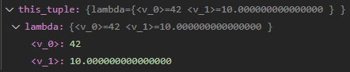

# lambda-tuple

[](https://sonarcloud.io/summary/new_code?id=Tradias_lambda-tuple)

An implementation of `std::tuple` based on variadic lambda capture ([P0780R2](https://open-std.org/JTC1/SC22/WG21/docs/papers/2018/p0780r2.html)) added in C++20. 
The idea is to store all elements of the tuple in such a lambda:

```cpp
[... v = std::move(v)](auto f) mutable -> decltype(auto)
{
    return f(v...);
}
```

I would consider it more of a toy implementation. Nonetheless, there is an extensive test suite including several tests from the Microsoft STL amounting to 75+ tests in total.

Play with it on [godbolt](https://godbolt.org/z/KW43rbTG6).

## Advantages

* Triviallity of copy/move construction of types is preserved.
* No template or function recursion used in the implementation. (except `std::conjunction` in requires and noexcept specifiers)
* Automatic pretty-printing in the debugger. E.g. for `tuple<int, double>`   

* An empty tuple is `std::is_trivial_v`.
* Roughly 2.6 times faster to compile with GCC and 1.9 times faster with Clang. ([build-bench](https://build-bench.com/b/eT0y_KsZ342kkIbMw8tndVLquC8))

## Disadvantages

* Cannot be passed across DLL boundaries.
* No in-place construction, just like `std::tuple`.
* Triviallity of copy/move assignment of types is not preserved, just like `std::tuple`.
* The compiler is allowed to re-order elements captured in the lambda to minimize its size (by ordering elements by their `sizeof` or performing empty-class optimization). In practice, however, none of the major compilers seem to make use of it. ([godbolt](https://godbolt.org/z/xqejPbczf))

# Installation

Copy the single header from [src/ltpl/tuple.hpp](src/ltpl/tuple.hpp) into your project.

Alternatively, use CMake to install the project. From the root of the repository:

```cmake
cmake -B build -S .
cmake --install build --prefix build/out
```

And in your CMake project's CMakeLists.txt:

```cmake
# Add build/out to the CMAKE_PREFIX_PATH
find_package(lambda-tuple)
target_link_libraries(my_app PRIVATE lambda-tuple::lambda-tuple)
```

# Usage

Include the single header:

```cpp
#include <ltpl/tuple.hpp>
```

And use `ltpl::Tuple` just like `std::tuple`.

# Requirements

The only requirement is a small subset of C++20.

The following compilers are continuously tested by Github Actions:

* GCC 10,
* Clang 10
* MSVc 19.32
* AppleClang 13
